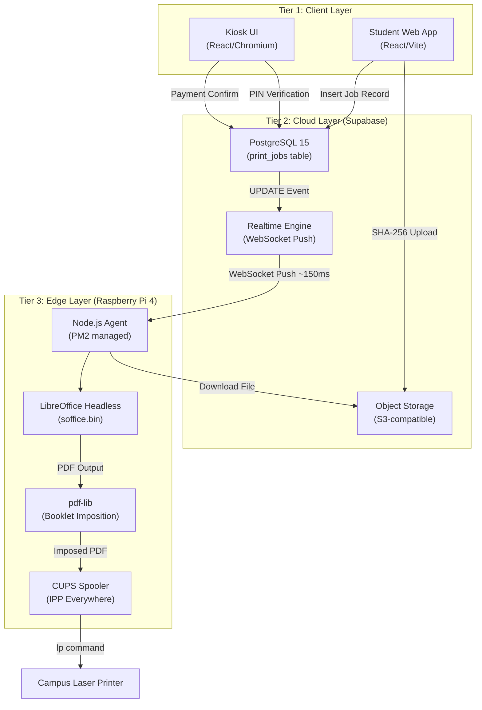
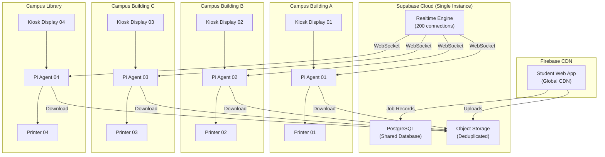

**26. Architecture & Scaling Diagram Set**

*How to attach: Copy each diagram block into [mermaid.live](https://mermaid.live), screenshot the rendered output, and paste the image into your Word document under this section.*

---

**Diagram 1: Current Three-Tier System Architecture**

---

**Diagram 2: Scaled Multi-Node Campus Deployment**

---

**Diagram 3: Data Flow & Lifecycle Pipeline**

```mermaid
flowchart LR
    A["User Selects File"] --> B["Client Extracts<br/>Page Count (JSZip)"]
    B --> C["Client Generates<br/>SHA-256 Hash"]
    C --> D{"Duplicate<br/>Detected?"}
    D -->|"Yes"| E["Skip Upload<br/>(Reuse Existing)"]
    D -->|"No"| F["Upload to<br/>Supabase Storage"]
    E --> G["Insert print_job<br/>(Status: pending)"]
    F --> G
    G --> H["User Enters PIN<br/>at Kiosk"]
    H --> I["Payment Confirmed<br/>(Status: processing)"]
    I --> J["WebSocket Push<br/>to Pi Agent"]
    J --> K{"File Format?"}
    K -->|"PDF"| M["Direct Spool"]
    K -->|"Office/Image"| L["LibreOffice<br/>Conversion"]
    L --> M
    M --> N{"A3 Booklet?"}
    N -->|"Yes"| O["Saddle-Stitch<br/>Imposition"]
    N -->|"No"| P["Standard Print"]
    O --> P
    P --> Q["CUPS lp Command<br/>(IPP Everywhere)"]
    Q --> R["Physical Printout"]
    R --> S["Status: completed"]
    S --> T["24h Cleanup<br/>Cron Purge"]
```

