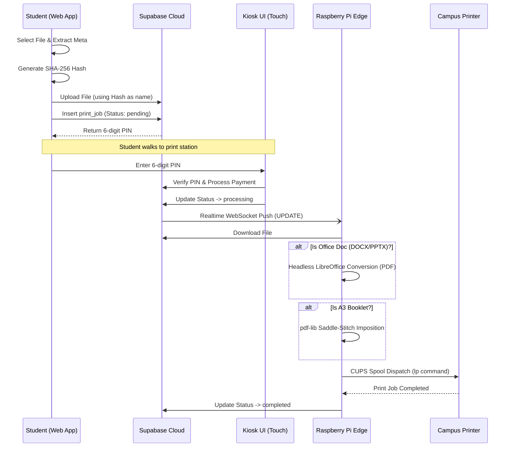

```mermaid
sequenceDiagram
    participant Student as Student (Web App)
    participant Supabase as Supabase Cloud
    participant Kiosk as Kiosk UI (Touch)
    participant PiAgent as Raspberry Pi Edge
    participant Printer as Campus Printer

    Student->>Student: Select File & Extract Meta
    Student->>Student: Generate SHA-256 Hash
    Student->>Supabase: Upload File (using Hash as name)
    Student->>Supabase: Insert print_job (Status: pending)
    Supabase-->>Student: Return 6-digit PIN
    
    Note over Student,Kiosk: Student walks to print station
    
    Student->>Kiosk: Enter 6-digit PIN
    Kiosk->>Supabase: Verify PIN & Process Payment
    Kiosk->>Supabase: Update Status -> processing
    
    Supabase-)PiAgent: Realtime WebSocket Push (UPDATE)
    
    PiAgent->>Supabase: Download File
    
    alt Is Office Doc (DOCX/PPTX)?
        PiAgent->>PiAgent: Headless LibreOffice Conversion (PDF)
    end
    
    alt Is A3 Booklet?
        PiAgent->>PiAgent: pdf-lib Saddle-Stitch Imposition
    end
    
    PiAgent->>Printer: CUPS Spool Dispatch (lp command)
    Printer-->>PiAgent: Print Job Completed
    PiAgent->>Supabase: Update Status -> completed
```
